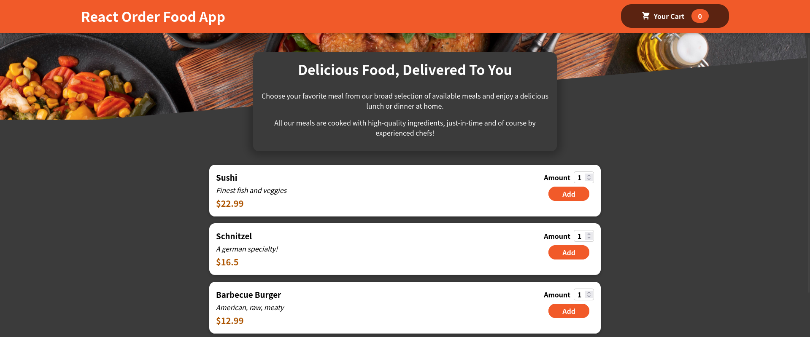

# Food Order App

I recently developed a simple food ordering app using React, Typescript, SCSS, and HTML. The app fetches a list of food items from an API, displays them in a menu, and allows users to select their desired dishes and submit their orders. As a beginner in React, this project was a great opportunity to learn the basics of the framework and develop my skills in web development. I'm excited to continue building more projects with React and exploring its capabilities.



## Features

- Browse through a variety of delicious dishes

- Add items to your cart

- Review your order and checkout

- Responsive design for mobile and desktop devices

## Prerequisites

- Node.js (v14 or newer)
- NPM (v7 or newer)

## Installation

To install the required dependencies, open your terminal and run the following commands:

```sh
git clone https://github.com/hossein-shayesteh/react-food-order.git
cd react-app
npm install
```

## Usage

To start the development server, run:

```sh
npm run dev
```

Your application should now be live at `http://localhost:3000`.

## Build

To build the application for production, run:

```sh
npm run build
```

## Contributing

Pull requests are welcome. For major changes, please open an issue first to discuss what you would like to change.

## License

[MIT](https://choosealicense.com/licenses/mit/)
